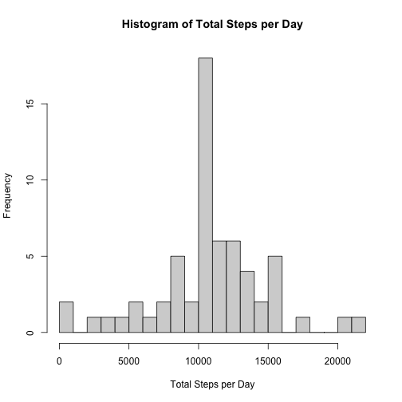
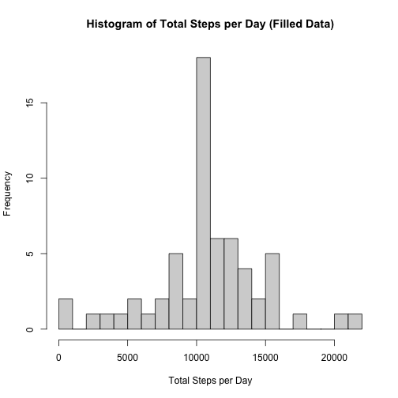
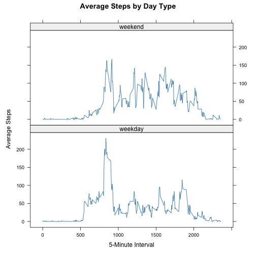

# Introduction

This report analyzes activity data from the provided CSV file.

1. Loading and Preprocessing Data


```r
# Load the data from the CSV file
data <- read.csv("activity.csv")

# Display the structure of the loaded dataset
str(data)
```

```
## 'data.frame':	17568 obs. of  3 variables:
##  $ steps   : int  NA NA NA NA NA NA NA NA NA NA ...
##  $ date    : chr  "2012-10-01" "2012-10-01" "2012-10-01" "2012-10-01" ...
##  $ interval: int  0 5 10 15 20 25 30 35 40 45 ...
```

```r
# Check for missing values
summary(is.na(data))
```

```
##    steps            date          interval      
##  Mode :logical   Mode :logical   Mode :logical  
##  FALSE:15264     FALSE:17568     FALSE:17568    
##  TRUE :2304
```

```r
# If there are missing values in 'steps' column, handle them (for example, filling missing steps with mean)
data$steps[is.na(data$steps)] <- mean(data$steps, na.rm = TRUE)

# Convert the 'date' column to Date format
data$date <- as.Date(data$date)

# Optionally, you may want to aggregate data by date or perform other transformations for analysis
# For example, calculating total steps per day
library(dplyr) # Loading the dplyr library for data manipulation

steps_per_day <- data %>%
  group_by(date) %>%
  summarise(total_steps = sum(steps, na.rm = TRUE))

# View the first few rows of the aggregated dataset
head(steps_per_day)
```

```
## # A tibble: 6 × 2
##   date       total_steps
##   <date>           <dbl>
## 1 2012-10-01      10766.
## 2 2012-10-02        126 
## 3 2012-10-03      11352 
## 4 2012-10-04      12116 
## 5 2012-10-05      13294 
## 6 2012-10-06      15420
```

2. Calculating Total Steps per Day


```r
# Aggregate data to calculate total steps per day (ignoring missing values)
steps_per_day <- aggregate(steps ~ date, data = data, FUN = sum, na.rm = TRUE)

# Calculate mean and median of total steps per day
mean_steps <- mean(steps_per_day$steps)
median_steps <- median(steps_per_day$steps)

# Print the mean and median
cat("Mean steps per day:", mean_steps, "\n")
```

```
## Mean steps per day: 10766.19
```

```r
cat("Median steps per day:", median_steps, "\n")
```

```
## Median steps per day: 10766.19
```

```r
# Create a histogram of total steps per day
hist(steps_per_day$steps, breaks = 20, xlab = "Total Steps per Day", ylab = "Frequency",
     main = "Histogram of Total Steps per Day")
```



3. Loading Data and Handling Missing Values


```r
# Load the data from the CSV file
data <- read.csv("activity.csv")

# Calculate and report the total number of missing values in the 'steps' column
total_missing <- sum(is.na(data$steps))
cat("Total number of missing values in the 'steps' column:", total_missing, "\n")
```

```
## Total number of missing values in the 'steps' column: 2304
```

```r
# Devise a strategy to fill missing values (e.g., using mean for that 5-minute interval)
# Calculate mean steps for each interval
mean_steps_interval <- aggregate(steps ~ interval, data = data, FUN = mean, na.rm = TRUE)

# Function to fill missing steps using mean steps for that interval
fill_missing_steps <- function(steps, interval) {
  if (is.na(steps)) {
    return(mean_steps_interval$steps[mean_steps_interval$interval == interval])
  } else {
    return(steps)
  }
}

# Create a new dataset with missing values filled in
data_filled <- data
data_filled$steps <- mapply(fill_missing_steps, data_filled$steps, data_filled$interval)

# Calculate total steps per day for the filled dataset
steps_per_day_filled <- aggregate(steps ~ date, data = data_filled, FUN = sum)

# Create a histogram of total steps per day
hist(steps_per_day_filled$steps, breaks = 20,
     xlab = "Total Steps per Day", ylab = "Frequency",
     main = "Histogram of Total Steps per Day (Filled Data)")
```



```r
# Calculate and report mean and median total steps per day
mean_steps_filled <- mean(steps_per_day_filled$steps)
median_steps_filled <- median(steps_per_day_filled$steps)

cat("Filled Dataset (after imputing missing data):\n")
```

```
## Filled Dataset (after imputing missing data):
```

```r
cat("Mean steps per day:", mean_steps_filled, "\n")
```

```
## Mean steps per day: 10766.19
```

```r
cat("Median steps per day:", median_steps_filled, "\n")
```

```
## Median steps per day: 10766.19
```

## Creating Factor Variable and Analyzing Activity Patterns


```r
# Assuming 'data_filled' contains the dataset with missing values filled in

# Convert 'date' column to Date format
data_filled$date <- as.Date(data_filled$date)

# Create a new factor variable indicating weekday or weekend
data_filled$day_type <- factor(ifelse(weekdays(data_filled$date) %in% c("Saturday", "Sunday"), "weekend", "weekday"))

# Load the lattice library for panel plots
library(lattice)

# Aggregate data by interval and day_type (weekday/weekend), calculate average steps
avg_steps_day_type <- aggregate(steps ~ interval + day_type, data = data_filled, FUN = mean)

# Make a panel plot of average steps for weekday and weekend
xyplot(steps ~ interval | day_type, data = avg_steps_day_type, type = "l",
       xlab = "5-Minute Interval", ylab = "Average Steps",
       layout = c(1, 2),       # 1 row, 2 columns for weekday and weekend
       main = "Average Steps by Day Type")
```


